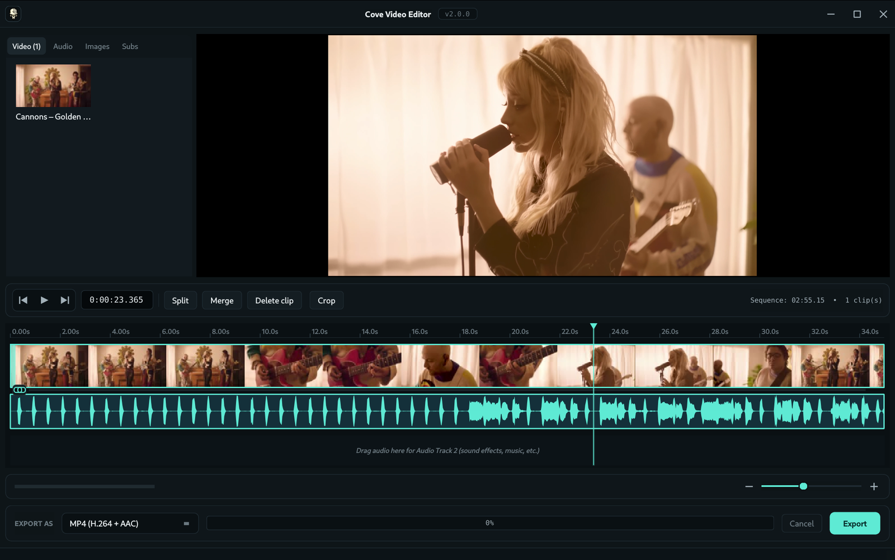

# Cove Video Editor

A lightweight offline video editor — a VideoPad-style timeline with multi-clip
video, multiple audio tracks, trim / split / crop / region operations,
burn-in subtitles, and a one-shot ffmpeg export. Built with
[PySide6](https://wiki.qt.io/Qt_for_Python). Fully offline, no cloud, no
accounts.

One codebase, native builds for Windows and Linux: a Windows installer and
portable exe, plus a Linux AppImage and `.deb`. Every `v*` tag cuts all four
artifacts via GitHub Actions.




---

## What's new in v2.1.2

- **Collapsible export log** — a "Details ▸" toggle next to the export
  controls reveals the full ffmpeg command, live progress lines, and any
  stderr output. Auto-expands on failure; collapses cleanly when not needed.
  One-click "Copy log" for pasting into bug reports.
- **Export deadlock fix** — stderr is now drained on a background thread so
  VP9/WebM and other verbose encoders can no longer fill the OS pipe buffer
  and hang the export at "starting…".
- **AVI/MP3 image-clip fix** — still images exported to AVI now produce valid
  audio (44 100 Hz, fltp, stereo) so libmp3lame no longer bails with "Could
  not open encoder before EOF".
- **`-nostdin` + `DEVNULL`** — ffmpeg never waits for terminal input, making
  automated and headless exports fully reliable.
- **Smoke-test script** (`scripts/smoke-export-formats.py`) — exercises all
  9 export formats against video, no-audio, still-image, gap, and added-audio
  timelines; validates stream presence and packet count via ffprobe.

## What's new in v2.1.0

- **Download Video workflow** — new toolbar button opens a native PySide6
  download dialog. Paste a URL, pick a destination, and the file is
  downloaded via `yt-dlp` and dropped straight onto the timeline at the
  playhead. No detour through the OS file manager.
- **Editor-friendly MP4 preference** — the downloader prefers H.264 video
  with AAC audio in an MP4 container so the result imports cleanly into
  the editor without re-encoding.
- **Auto-import after download** — the downloaded clip is added to the
  Video bin and inserted at the current playhead automatically.
- **Preview layout resize fix (issue #1)** — the preview pane now resizes
  correctly when the window is resized or the timeline track divider is
  dragged.

## What's new in v2.0.0 — The Redesign

v2.0.0 is a ground-up visual redesign. Every pixel of the editor has been
rethought to match the Cove family aesthetic (Nexus / Downloader) — the
editing model and ffmpeg pipeline underneath are unchanged, just cleaner
and more legible on top.

**New look**

- **Frameless window with custom titlebar** — Cove skull badge on the left,
  centered title + version pill, minimize / maximize / close on the right.
  Edge-drag resize handled via `QWindow.startSystemResize` so X11, Wayland,
  and Windows all behave correctly.
- **Dark teal palette** — `#0b1013` background, `#5eead4` accent, Inter for
  UI, JetBrains Mono for timecodes and numeric labels. Centralized in
  `theme.py` (palette + QSS) so anything you bolt onto the app gets the
  right treatment for free.
- **Tabbed file bin** — Video / Audio / Images / Subs live side-by-side
  with live count badges. No hidden tabs; everything fits at any sane
  window width.
- **VideoPad-style tile selection** — darker inner tile + accent border +
  readable filename, instead of the old fade-to-invisible selection state.
- **Icon-only transport cluster** — Rewind / Play-Pause / End grouped in a
  bordered pill, monospace timecode next to it, Split / Merge / Delete /
  Crop tool buttons after the divider.
- **Primary teal Export button** — the only accent-tinted action in the
  bottom bar, so it's obvious what to click when the timeline's ready.
- **Teal playhead with glow** over a crisp `#0a1013` ruler, clip bodies in
  the dark-teal family, audio lanes in warm amber, chain chip in accent
  (linked) or red (unlinked). Waveforms rendered in teal for clip audio
  and amber for added audio.

**Subtitles that actually match on export**

- **Preview and burn-in are now 1:1.** Previously libass silently scaled
  SRTs up by ~2.5× on export (PlayRes 288 → output height) — no more
  guess-the-size-and-re-export loop. The exporter emits a full ASS file
  with `PlayResX` / `PlayResY` matching the output resolution, so a 36-px
  font in the Style dialog is 36 px in the exported video.
- **Font picker** in the Style dialog — Arial, Helvetica, Liberation Sans,
  DejaVu Sans, Roboto, Open Sans, Noto Sans, Inter, Verdana, Tahoma,
  Trebuchet MS, Georgia, Times New Roman, Courier New, Liberation Mono,
  JetBrains Mono, Impact, Comic Sans MS. The list is filtered to what's
  installed on the current system. `FontName` flows through to libass, so
  preview and export use the same typeface.
- **Outer-only outline** — the overlay is built from a `QPainterPath` with
  the outline drawn behind the fill layer, so glyph interiors stay solid
  (no more wireframe-looking text).

**Cross-platform build from Linux**

- New `scripts/build-windows-wine.sh` cross-builds `Setup.exe` and
  `Portable.exe` from a Linux host under Wine (installs Windows Python,
  PySide6, PyInstaller, and Inno Setup 6 into a dedicated prefix and
  drives the same Inno Setup script `build.ps1` uses). Native
  `build.ps1` on Windows is still the canonical path; the wine script is
  a convenience for Linux maintainers who want to ship a Windows
  artifact without leaving their desk.
- `faulthandler.enable()` is now guarded — fixes the `RuntimeError:
  sys.stderr is None` crash the PyInstaller `--windowed` portable hit on
  first launch.

---

## Features

### Timeline

- **Multi-clip video track** — drag any number of videos onto the timeline,
  place them at the cursor, snap to playhead / clip edges / t=0 while dragging.
  Overlaps auto-resolve to the right.
- **Unlimited audio tracks**
  - **Audio Track 1** — sits next to the clip audio; drop independent audio
    clips here to fill gaps between video clips.
  - **Audio Track 2 and beyond** — dedicated overlay lanes for sound effects,
    music, or anything you want mixed on top. A fresh empty lane auto-appears
    below the last used one so you always have a drop target.
- **Drag the teal playhead** anywhere on the ruler to scrub; click inside the
  tracks to move it too. Playhead-aware snapping while moving clips.
- **Region select / delete / crop / export** — shift-drag any time range; delete
  it (ripple), keep only it (crop-to-selection), or export just that slice.
- **Split at playhead** (`S`) — cut the clip under the playhead into two.
- **Per-clip trim handles** on the video row, with the right edge anchored so
  the trim feels like VideoPad. Thumbnails follow the trimmed range.
- **Drag the video/audio divider** to resize video vs. audio track heights
  without losing screen real estate.
- **Scroll wheel zooms** around the cursor; **shift+scroll** pans horizontally.
- **Undo** up to 80 steps (`Ctrl+Z`, `Ctrl+Y` to redo).

### Audio model

- **Linked clip audio** (teal) — plays locked to the video.
- **Unlink** (chain chip) → audio becomes **amber** and draggable along the
  audio row. The video moves independently; the audio's absolute position is
  preserved when you move the video.
- **Delete an unlinked clip's audio** with `Delete` — the track shows
  `(audio deleted — chain chip to restore)`; click the chain chip to bring it
  back.
- **Waveforms** are rendered from real peak data with linear interpolation at
  high zoom, not a scaled bitmap.
- **Multiple added-audio clips per lane** — drop as many as you want. Each is
  independently selectable, draggable, deletable, and keeps its natural
  duration (no loops, no stretches).

### Playback

- **Timer-driven playhead** — playback works over gaps (preview goes black and
  audio keeps going) and on audio-only timelines (no video clip required).
- **Dedicated player for unlinked audio** — plays at the offset, silent
  outside the shifted range.
- **Aux players resync on scrub** so moving the playhead during playback
  doesn't leave audio stuck on the old position.
- **Black preview in gaps** — the video item hides when the playhead isn't on
  any clip, instead of freezing on the last frame.

### Media bin

- **Drag files** directly from the OS anywhere on the window or timeline, or
  click into the empty-tab drop zone to open a file picker.
- **Placeholder thumbnails** show a play-triangle (video), speaker (audio),
  mountains (image), or CC glyph (subs) until the real thumb is extracted —
  tiles never look like bare text.
- **Delete** removes the asset and any clips/audios that used it.
- **Drag a bin tile onto the timeline** — video lands at the drop x, audio
  lands on the lane under the cursor.

### Editing

- **Crop tool** — toggle an overlay on the preview, drag corners/edges to
  size, drag inside to move, reset with one click. Exports respect the crop.
- **Clip properties dialog** (double-click a clip) — fine-tune speed
  (0.25×–4×), trim start / end with numeric input, or mute the clip.
- **Region context menu** (right-click) — delete, crop-to-selection, or export
  only the selected region.

### Subtitles

- **SRT / VTT import** — drop onto the Subs tab. Double-click a row to make
  it the active burn-in track.
- **Live preview** at the playhead, exactly matching what libass will burn
  into the export (1:1 — same font, size, position, outline).
- **Style dialog** — font family (filtered to installed fonts), font size,
  text color, outline color, outline width, top / bottom position.
- **Sync dialog** — nudge the track by ± N ms; offset is baked into the ASS
  written to the temp dir on export so preview, sync dial, and burn-in
  stay in lockstep.

### Updates

- **Auto-update notification** on startup checks the GitHub releases API.
  When a newer version is published, a dialog offers to install it. AppImage
  installs get an in-place download + swap + relaunch; other packagings open
  the release page in the user's browser.

### Export

- **MP4 (H.264 + AAC), MP4 (H.265), MKV, WebM (VP9 + Opus), MOV, AVI, GIF,
  MP3, WAV** — all driven from the same ffmpeg filtergraph.
- **Region export** — export only the selected range by piping the final map
  through `-ss` / `-t`.
- **Audio Track 1 + 2+ mix** — every added-audio clip is `atrim`'d to its own
  duration, `adelay`'d to its offset, `apad`'ed to the timeline length, then
  `amix`'d together. Optional "replace original audio" swap.
- **Subtitle burn-in** via libass with a PlayRes-matched ASS file so font
  sizes land exactly where the preview shows them.
- **Live progress + ETA** from `ffmpeg -progress pipe:1` with EMA smoothing.
- **Bundled ffmpeg** — no separate install required in the release builds.

---

## Install a prebuilt release

Head to the [Releases page](https://github.com/Sin213/cove-video-editor/releases)
and grab the artifact for your OS:

| OS      | Artifact                                      | Notes                                        |
| ------- | --------------------------------------------- | -------------------------------------------- |
| Windows | `cove-video-editor-<version>-Setup.exe`       | Inno Setup installer (Start Menu + Desktop)  |
| Windows | `cove-video-editor-<version>-Portable.exe`    | Single-file, no install                      |
| Linux   | `Cove-Video-Editor-<version>-x86_64.AppImage` | `chmod +x` and run                           |
| Linux   | `cove-video-editor_<version>_amd64.deb`       | `sudo apt install ./cove-video-editor_*.deb` |

`ffmpeg` and `ffprobe` are **bundled inside every artifact** — no additional
installs needed.

> **Windows SmartScreen** may warn on first launch because the exe isn't
> signed. Click **More info → Run anyway**.

---

## Keyboard + mouse cheatsheet

| Action                              | Shortcut                                |
| ----------------------------------- | --------------------------------------- |
| Play / pause                        | `Space`                                 |
| Next / previous frame               | `.` / `,`                               |
| Split at playhead                   | `S`                                     |
| Merge selected clip with next / previous | `M` / `Shift+M`                    |
| Jump to selected clip start / end   | `[` / `]`                               |
| Previous / next clip edge           | `Alt+,` / `Alt+.`                       |
| Jump to sequence start / end        | `Home` / `End`                          |
| Delete selected region / audio / clip | `Delete` / `Backspace`                |
| Undo / Redo                         | `Ctrl+Z` / `Ctrl+Y`                     |
| Exit crop mode                      | `Esc`                                   |
| Region-select                       | Shift-drag, or drag in empty timeline   |
| Seek                                | Click anywhere on the ruler, or drag    |
| Zoom in / out                       | Mouse wheel                             |
| Pan horizontally                    | Shift + wheel                           |
| Resize video vs. audio track heights | Drag the divider between them          |

---

## Running from source (Linux)

Python 3.10+. On Arch:

```bash
sudo pacman -S python pyside6 ffmpeg
python -m venv .venv
.venv/bin/pip install -r requirements.txt
PYTHONPATH=src .venv/bin/python -m cove_video_editor
```

On Debian / Ubuntu:

```bash
sudo apt install python3 python3-pyside6.qtwidgets ffmpeg
python3 -m venv .venv
.venv/bin/pip install -r requirements.txt
PYTHONPATH=src .venv/bin/python -m cove_video_editor
```

---

## Running from source (Windows)

Python 3.10+ from [python.org](https://www.python.org/downloads/) (tick
**"Add python.exe to PATH"** during install).

```powershell
py -m venv .venv
.venv\Scripts\pip install -r requirements.txt

# ffmpeg via winget…
winget install Gyan.FFmpeg
# …or drop ffmpeg.exe + ffprobe.exe somewhere on PATH.

$env:PYTHONPATH = "src"
.venv\Scripts\python -m cove_video_editor
```

---

## Building release artifacts yourself

PyInstaller can't cross-compile natively, so the recipe depends on your host.
Both Linux scripts download ffmpeg automatically.

### Linux — AppImage + .deb

```bash
VERSION=2.1.2 bash scripts/build-release.sh
# Output in release/:
#   Cove-Video-Editor-2.1.2-x86_64.AppImage
#   cove-video-editor_2.1.2_amd64.deb
```

`SKIP_DEB=1 VERSION=2.1.2 bash scripts/build-release.sh` builds just the
AppImage.

### Windows — Setup.exe + Portable.exe (native)

Requires [Inno Setup 6](https://jrsoftware.org/isdl.php) (pre-installed on
GitHub Actions' `windows-latest`).

```powershell
.\build.ps1 -Version 2.1.2
# Output in release\:
#   cove-video-editor-2.1.2-Setup.exe
#   cove-video-editor-2.1.2-Portable.exe
```

### Windows — Setup.exe + Portable.exe (from Linux, via Wine)

`scripts/build-windows-wine.sh` provisions a dedicated `$HOME/.wine-covebuild`
prefix on first run: Python 3.12 for Windows, PySide6, Pillow, PyInstaller,
and Inno Setup 6. Subsequent runs reuse the prefix.

```bash
VERSION=2.1.2 bash scripts/build-windows-wine.sh
# Output in release/:
#   cove-video-editor-2.1.2-Setup.exe
#   cove-video-editor-2.1.2-Portable.exe
```

### Automated release via GitHub Actions

Push a tag matching `v*` (e.g. `v2.1.2`) and `.github/workflows/release.yml`
runs the Linux + Windows jobs in parallel and attaches all four artifacts to
the GitHub Release created for the tag.

---

## How it works

```
src/cove_video_editor/
├── __main__.py        entry point + theme install + FFmpeg backend selection
├── theme.py           centralized palette + QSS + font resolution
├── titlebar.py        frameless TitleBar widget + system-resize helper
├── app.py             MainWindow: players, timer-driven playback, undo, export glue
├── timeline_widget.py timeline canvas: ruler, video, audio lanes, chain chip
├── clip.py            Clip, AddedAudio, MediaAsset, SubtitleTrack + region ops
├── clip_bin.py        left-side media library with drag source
├── crop_overlay.py    draggable crop rect with rule-of-thirds guides
├── thumbnails.py      QThread workers for thumbnails + peak waveforms
├── exporter.py        ffmpeg filtergraph + ASS writer + progress loop
├── ffmpeg_utils.py    ffprobe wrapper + format table + binary resolution
├── updater.py         GitHub releases poll + AppImage in-place swap
└── assets/            icon

packaging/
├── installer.iss                  Inno Setup script
├── launcher.py                    PyInstaller entry point
└── cove-video-editor.desktop      Linux desktop entry

build.ps1                          Windows Setup.exe + Portable.exe builder
scripts/build-release.sh           Linux AppImage + .deb builder
scripts/build-windows-wine.sh      Windows builder from Linux via Wine
.github/workflows/release.yml      Cross-platform release CI
```

Playback is driven by a `QTimer`; the main `QMediaPlayer` is a passive
renderer whose position is slaved to the timeline. A dedicated second player
handles unlinked-clip audio (shifted to the user's offset), and each added
audio clip has its own `QMediaPlayer` that plays in its range and pauses
outside it — so the playhead can scrub across gaps, audio-only spans, or
past the last video, with the preview going black.

Export is one ffmpeg invocation per job: each clip becomes an input, a
`filter_complex` graph trims / crops / scales / speed-adjusts / concatenates
them, and each audio track is placed with `atrim + adelay + apad` before
being `amix`'d with the clip audio (or replacing it). Subtitles are
re-materialized into a temp ASS file with `PlayResX/PlayResY` set to the
output resolution so `Fontsize` is in output pixels and matches the editor's
live preview. Progress is parsed from `ffmpeg -progress pipe:1`; ETA is
derived from elapsed time vs. completion percentage with an EMA smoother.

---

## Credits

- [Qt for Python (PySide6)](https://wiki.qt.io/Qt_for_Python) — UI toolkit.
- [FFmpeg](https://ffmpeg.org/) — every video frame, audio sample, and filter.
- [libass](https://github.com/libass/libass) (inside ffmpeg) — subtitle burn-in.
- [Inno Setup](https://jrsoftware.org/isinfo.php) — the `Setup.exe` installer.
- [Inter](https://rsms.me/inter/) + [JetBrains Mono](https://www.jetbrains.com/lp/mono/) — design fonts.

---

## Licensing

- Cove Video Editor is **MIT** — see `LICENSE`.
- The bundled `ffmpeg` / `ffprobe` binaries are the **gyan.dev
  release-essentials** (Windows) and **johnvansickle.com static** (Linux)
  builds, both **GPLv3**. Cove Video Editor shells out to these binaries
  rather than linking, so the app's MIT licensing stands. If you redistribute
  release artifacts, comply with the ffmpeg GPL terms — most commonly by
  keeping `FFMPEG-LICENSE.txt` alongside the binary and pointing recipients
  at [ffmpeg.org](https://ffmpeg.org/) for sources.
